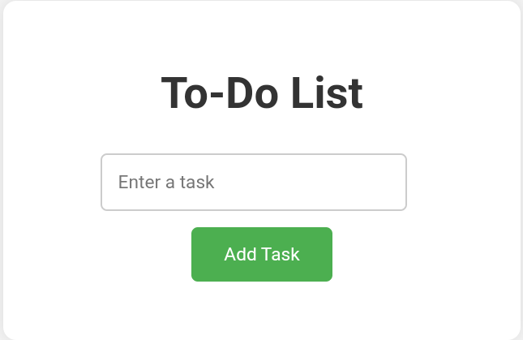
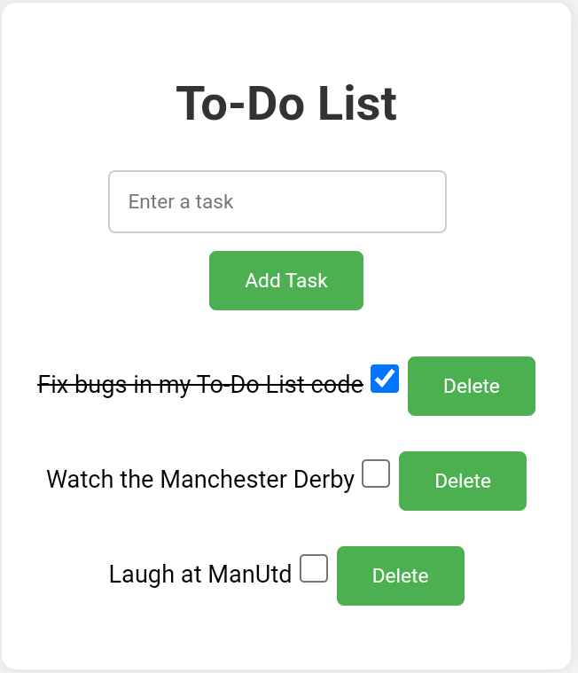

# To-Do List App

A simple web application for managing your to-do list. Add tasks, mark them as completed, and delete them when done.

## Features

- Add tasks to your to-do list.
- Mark tasks as completed with a checkbox.
- Delete tasks from the list.

## Getting Started

1. Clone this repository.
2. Open `index.html` in your web browser.

## Usage

1. Enter a task in the input field.
2. Click the "Add Task" button.
3. Mark tasks as completed using the checkbox.
4. Delete tasks with the "Delete" button.

## License

This project is licensed under the MIT License.
